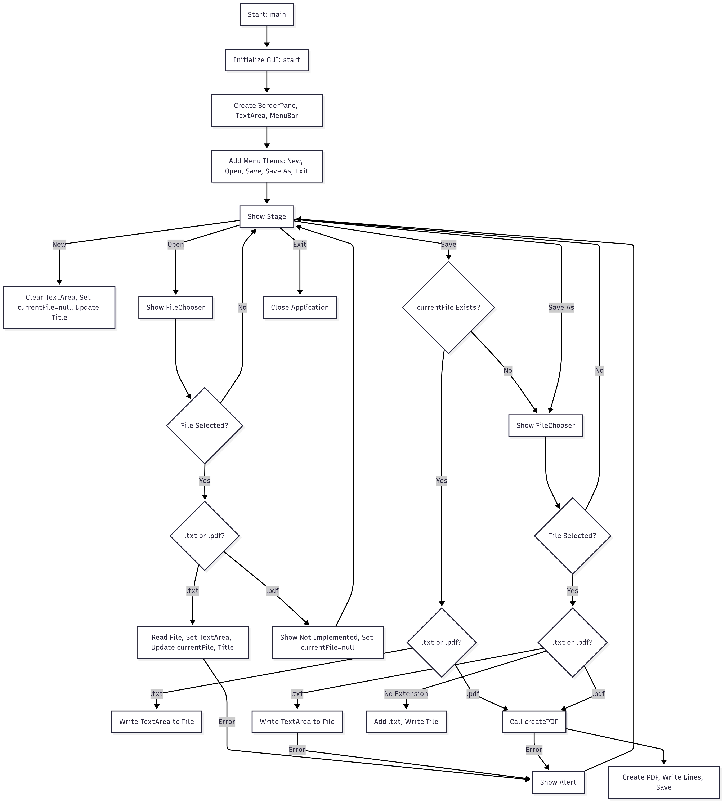

# TextEditor
* A minimalist, cross-platform text editor built with JavaFX, supporting .txt and basic .pdf file creation. 
* Designed to run on Windows and Linux, this project demonstrates skills in Java, GUI development, file handling, and standalone application deployment.

## Features
* Create, open, and save .txt files.
*  Create basic .pdf files with text content.
*  Minimalist UI using JavaFX.
*  Cross-platform compatibility (Windows and Linux).
*  Deployable as a native executable.

## FlowChart

## Prerequisites

* JDK 17 or later with JavaFX (e.g., Azul Zulu JDK 17 with JavaFX)
* Maven
* VS Code with Java Extension Pack (optional)

## Setup (Linux)

1) Install Azul Zulu JDK with JavaFX:tar -xzf zulu17.58.21-ca-fx-jdk17.0.15-linux_x64.tar.gz

2) Clone the repository:
* `git clone https://github.com/1nV0ker7/TextEditor.git`
* `cd TextEditor`

3) Build the project:
* `mvn clean package`

4) Run the JAR:
* `java --module-path target/libs --add-modules javafx.controls,javafx.fxml,javafx.graphics -jar target/TextEditor-1.0-SNAPSHOT.jar`

## Deployment (Linux)
### Native Executable ##

1) Build the .deb package:
* `jpackage --name TextEditor --input target --main-jar TextEditor-1.0-SNAPSHOT.jar --main-class com.invoker.TextEditor --type deb --dest dist --linux-shortcut --linux-menu-group "Utility" --module-path target/libs --add-modules javafx.controls,javafx.fxml,javafx.graphics`

2) Install:
* `sudo dpkg -i dist/TextEditor-1.0-SNAPSHOT.deb`
* `sudo apt-get install -f`

## Artifacts
The GitHub Actions workflow produces a `TextEditor-JAR` artifact, including the executable JAR (`TextEditor-1.0-SNAPSHOT.jar`) and dependencies (`libs/`), available for download from the [Actions](https://github.com/1nV0ker7/TextEditor/actions). To run:

* `unzip TextEditor-JAR.zip -d TextEditor-JAR`
* `java --module-path TextEditor-JAR/libs --add-modules javafx.controls,javafx.fxml,javafx.graphics -jar TextEditor-JAR/TextEditor-1.0-SNAPSHOT.jar`

## Troubleshooting

### If compilation errors occur:
1. Clear Maven cache: 
  * `rm -rf ~/.m2/repository`
2.  Run:
  * mvn clean install -U
3. Ensure _**src/main/java/com/package/TextEditor.java**_ exists.

### Errors in VS Code:
Add to **_~/.vscode/settings.json_**:
 * ` {"java.configuration.runtimes": [{"name": "JavaSE-17","path": "/opt/zulu-17","default": true}],"java.project.referencedLibraries": ["target/libs/*.jar"]}`

Install native libraries: 
* `sudo apt-get install openjfx`

# Future Enhancements

*  PDF text extraction.
*  Syntax highlighting for .py, .java files.
*  Custom app icon.

## Portfolio Note
This project showcases expertise in:
- JavaFX for cross-platform GUI development.
- Apache PDFBox for PDF creation.
- Maven for dependency management and build automation.
- `jpackage` for creating native installers.
- Git for version control, including resolving merge conflicts and syncing repositories.
- GitHub Actions for CI/CD, updated to use `actions/upload-artifact@v4` to address deprecation.

### About Me
Checkout my [portfolio](https://1nv0ker7.github.io/Invoker.github.io/) for more projects!
